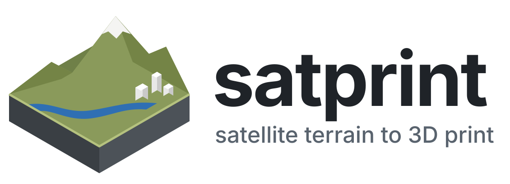
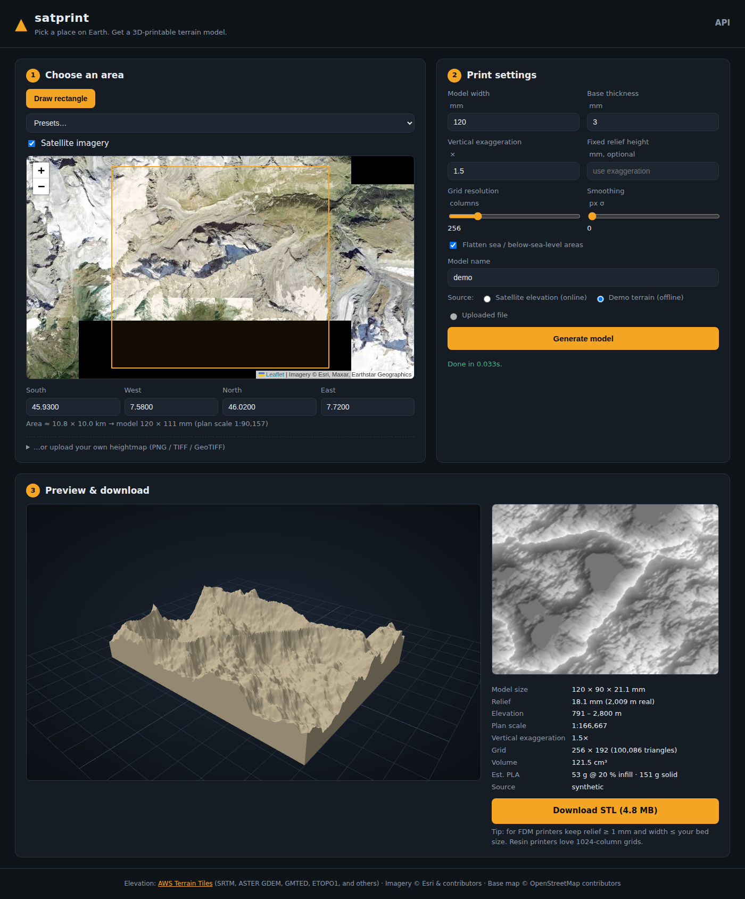
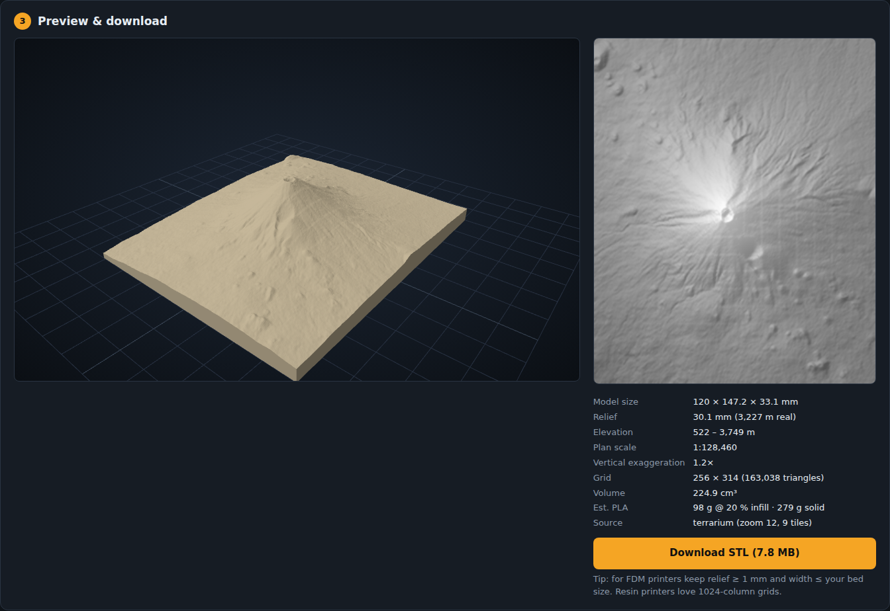

<p align="center">
  <picture>
    <source media="(prefers-color-scheme: dark)" srcset="docs/brand/satprint-logo-dark.svg">
    
  </picture>
</p>

[](https://github.com/suchanek/satprint/actions/workflows/tests.yml)
[](https://suchanek.github.io/satprint/)
[](https://www.python.org/)
[](LICENSE)
[](https://github.com/suchanek/satprint/releases)
[](https://python-poetry.org/)
[](https://doi.org/10.5281/zenodo.23094151)
[](https://pre-commit.com/)
[](https://orcid.org/0009-0009-0891-1507)

# satprint -- Satellite Terrain to 3D-Printable Models

**Pick a place on a map. Get a watertight STL of its terrain and buildings, a multi-color 3MF ready for a multi-material printer, and a GLB with satellite imagery draped over it.**

satprint turns real elevation data into a solid relief model scaled to your
printer: the terrain on top, four walls and a flat base. Cities can carry their
OpenStreetMap buildings, and the multi-color 3MF splits the model into land,
water, buildings and a border frame, one filament each.

**Documentation: [suchanek.github.io/satprint](https://suchanek.github.io/satprint/)**

```
satellite elevation  ->  heightmap (meters)       ->  STL solid
AWS Terrain Tiles        clamp sea, smooth,           terrain + walls + base
(SRTM, ASTER, GMTED)     scale to mm, exaggerate      + OSM buildings
                                                      + land/water/border 3MF
```



Mount Fuji from real elevation tiles, 120 mm wide, 1.2x exaggeration:



## Features

- **Real elevation, no API key.** Elevation comes from the public
  [AWS Terrain Tiles](https://registry.opendata.aws/terrain-tiles/) set
  (SRTM, ASTER, GMTED and others), cached under `~/.cache/satprint/tiles`. You
  can also upload a 16-bit PNG, TIFF or GeoTIFF heightmap, or use a procedural
  demo terrain that needs no network.
- **Print-aware output.** True plan scale, vertical exaggeration or a fixed
  relief height, base thickness, sea-level flattening, Gaussian smoothing and
  grids up to 1024 columns. Each build reports model size, scale, triangle
  count, volume and an estimated PLA weight.
- **Watertight by construction.** Every edge is shared by exactly two
  outward-wound triangles, so slicers (Bambu Studio, PrusaSlicer, Cura,
  Chitubox) load the STL without repair.
- **Buildings** from OpenStreetMap, as closed solids standing on the terrain.
  Landmark towers keep their setbacks where OSM maps them as `building:part`
  shapes, and overlapping footprints are merged so no two solids pass through
  each other. Heights are in true proportion by default, with a multiplier.
- **Multi-color 3MF.** Land, water, buildings and an optional border frame are
  separate parts of one object, already on filaments 1 to 4 in Bambu Studio.
  Water is the OSM sea, rivers and lakes, plus the flattened sea.
- **Border frame.** A rectangular rim around the model, 1 mm above the base by
  default, in the STL, GLB and 3MF.
- **Textured GLB.** Satellite imagery draped over the terrain and the roofs,
  for viewing in Blender, macOS Quick Look or a web viewer. The web preview
  shows it.
- **Search and presets.** Search any place by name, or pick one of 67 presets:
  37 cities and landmarks, which turn buildings on, and 30 mountains and
  landscapes.
- **Web app, CLI and REST API.** Builds run as background jobs, and the page
  shows each stage with tile counts. Interactive API docs are at `/docs`.

## Install

satprint needs Python 3.12 or 3.13.

```bash
git clone https://github.com/suchanek/satprint.git
cd satprint
poetry install                   # add --extras geotiff for GeoTIFF georeferencing
```

Without Poetry, `pip install -e .` in a virtual environment installs the app.
See [Installation](https://suchanek.github.io/satprint/install/) for Docker.

## Run the web app

```bash
satprint serve                   # http://127.0.0.1:7417
satprint serve --host 0.0.0.0 --port 7417
```

1. **Choose an area.** Search for a place, pick a preset, click **Draw
   rectangle** and drag on the map, or type the bounds. The hint line shows the
   real size of the area and the model it makes.
2. **Set the print.** Model width, base thickness, vertical exaggeration
   (1.5x to 3x reads well for most landscapes; 1x is true scale) or a fixed
   relief height. Resolution sets the grid columns: 256 is fine for FDM, 512
   to 1024 for resin. Check **Add buildings** for a city, and **Multi-color
   3MF** plus a **Border frame** width for a multi-material print.
3. **Generate.** The textured model appears in the 3D preview. Download the
   STL to print in one color, the 3MF to print in several, or the GLB to view.

After you change the code, restart `satprint serve` to pick up the change.

## Print in several colors

The multi-color 3MF holds up to four parts, in this filament order:

| Filament | Part | Display color |
|---|---|---|
| 1 | `land` | green |
| 2 | `water` | blue |
| 3 | `buildings` | white |
| 4 | `border` | dark gray |

To print it on a Bambu printer with an AMS:

1. In Bambu Studio, set up four filaments in the left sidebar, or sync them
   from the AMS.
2. Open the 3MF. Bambu Studio reports that it loads "geometry only", as it does
   for any 3MF it did not write; the part names and filaments still come
   through.
3. To check or change a part's filament, open the object list: in the left
   sidebar, under **Process**, click **Objects** and expand the model.
4. Slice. The preview shows each part in its filament's color.

Other slicers open the same parts with every part on filament 1; assign the
filaments by hand.

## Command line

```bash
# Matterhorn, 120 mm wide, 2x exaggeration
satprint build --bbox 45.93 7.58 46.02 7.72 --width 120 --exaggeration 2 -o matterhorn.stl

# Fixed 15 mm relief, smoothed, with a hillshade preview PNG
satprint build --bbox 36.02 -112.25 36.20 -111.95 --relief 15 --smoothing 1 \
               --preview canyon.png -o grand-canyon.stl

# Midtown Manhattan with buildings, plus a textured GLB
satprint build --bbox 40.7414 -73.9997 40.7684 -73.9683 --width 150 \
               --buildings --glb midtown.glb -o midtown.stl

# Venice as a four-color 3MF: land, water, buildings and a 5 mm border frame
satprint build --bbox 45.43 12.32 45.446 12.343 --buildings --frame 5 \
               --3mf venice.3mf -o venice.stl

# From your own DEM in meters, 12 km across
satprint build --file dem.tif --ground-width 12000 -o dem.stl

# Offline demo terrain
satprint build --synthetic -o demo.stl
```

Bounds are `SOUTH WEST NORTH EAST` in decimal degrees. The command prints a
JSON summary: elevation range, scale, triangle count, volume and a watertight
check. `satprint build --help` lists every option.

## REST API

| Method | Path | Purpose |
|---|---|---|
| `GET` | `/api/presets` | Named example areas, grouped |
| `GET` | `/api/search?q=...` | Place search; each hit has a `bbox` |
| `POST` | `/api/upload` | Multipart heightmap upload; returns an `upload_id` |
| `POST` | `/api/model` | Build a model; returns stats, a preview PNG and download URLs |
| `POST` | `/api/jobs` | Same body as `/api/model`, built in the background; returns a `job_id` |
| `GET` | `/api/jobs/{id}` | Job `status`, current `stage` with `done` and `total`, and the `/api/model` response as `result` when done |
| `GET` | `/api/model/{id}/{name}.stl` | Binary STL |
| `GET` | `/api/model/{id}/{name}.glb` | Textured GLB, when `glb_url` is set |
| `GET` | `/api/model/{id}/{name}.3mf` | Multi-color 3MF, when `threemf_url` is set (`"multicolor": true`) |
| `GET` | `/api/model/{id}/heightmap.png` | Hillshade preview |

```bash
curl -s localhost:7417/api/model -H 'content-type: application/json' -d '{
  "source": "terrarium",
  "bbox": {"south": 35.28, "west": 138.65, "north": 35.45, "east": 138.82},
  "width_mm": 150, "exaggeration": 1.2, "resolution": 512, "name": "fuji"
}' | python -c 'import json,sys; j=json.load(sys.stdin); print(j["stl_url"], j["info"]["height_mm"])'
```

## How the scaling works

- **Plan scale** is `width_mm / ground_width_m`. The depth follows the true
  aspect ratio of the area, from great-circle distances along the center lines
  of the bounding box.
- **Vertical scale** is the plan scale times the exaggeration, so
  `exaggeration = 1` is a true-scale model. With `relief_mm` set, the vertical
  scale puts the highest point exactly that far above the base, and the
  effective exaggeration is reported back.
- **Sea level.** Samples below 0 m (bathymetry in the source data) are clamped
  to 0 by default, so coastlines print as a flat plane.
- **Buildings** use the plan scale for their heights, so `building_scale = 1`
  keeps them in true proportion to the map.

## Data sources

| Data | Source | Cache |
|---|---|---|
| Elevation | [AWS Terrain Tiles](https://registry.opendata.aws/terrain-tiles/) | `~/.cache/satprint/tiles` |
| Imagery (GLB texture) | Esri World Imagery | `~/.cache/satprint/imagery` |
| Buildings and water | [OpenFreeMap](https://openfreemap.org) vector tiles, zoom 14, rebuilt from OSM about weekly | `~/.cache/satprint/vtiles` |
| Buildings, fallback | [Overpass API](https://wiki.openstreetmap.org/wiki/Overpass_API), 0.01° tiles | `~/.cache/satprint/osm/tiles` |
| Place search | [Nominatim](https://nominatim.org), one request per second | in memory |

- **Buildings.** A building with no `height` or `building:levels` tag gets 8 m.
  Building parts are extruded from the ground, ignoring `min_height`, so
  nothing floats. Buildings sink 0.3 mm into the terrain so they fuse with it
  when sliced. Areas are limited to 40 km² with buildings on, and very small
  footprints are dropped. A building that crosses a vector-tile edge arrives as
  two solids that meet at the edge.
- **Overpass.** Choose it with "Building data" in the web app or
  `--building-source overpass` on the CLI, for the latest OSM edits. The
  default "auto" uses it only if OpenFreeMap fails. Its tiles download two at a
  time, busy answers are retried with backoff, and a server that times out is
  skipped for 10 minutes. When some tiles fail, the rest stay cached, so
  generating again fetches only the missing ones.
- **Imagery.** The texture is at most 2048 px on its longer side. Esri's terms
  of use govern the imagery. Set `"texture": false` to skip it.

## Limits

- Source resolution is about 30 m (SRTM) over most land and about 10 m at zoom
  14 where available, so areas smaller than about 2 km look blocky. Smoothing
  helps.
- Elevation and imagery downloads are capped at 64 tiles per request. Shrink the
  area or lower the resolution if you hit the cap.
- The multi-color split works one grid cell at a time, so a river narrower than
  a cell does not show. Raise the resolution to keep it.
- The GLB is for viewing. FDM slicers ignore textures, so print the STL or the
  3MF.
- Built models live in memory, the last 32. A download link is valid until the
  server restarts.

## Layout

```
satprint/
  terrain.py    elevation sources (terrain tiles, synthetic, file), imagery, scaling, hillshade
  mesh.py       heightmap to watertight solid, land/water split, frame, STL, GLB and 3MF writers
  buildings.py  OSM buildings to closed solids on the terrain
  water.py      water map and the multi-color 3MF parts
  osm.py        OpenFreeMap, Overpass and Nominatim clients
  presets.py    named example areas
  app.py        FastAPI backend, background jobs, in-memory model store
  cli.py        satprint serve / satprint build
  static/       web app: index.html, style.css, app.js (Leaflet and three.js from CDNs)
tests/          pytest suite, offline: every network client is faked
```

## Development

```bash
poetry install --with dev
pre-commit install
pytest -q
```

The pre-commit hooks run the standard file checks, ruff, detect-secrets, ty and
pytest. `pycodekg` and `dockg` index the repo for agents through `.mcp.json`;
they are global tools, not dependencies. To build the docs site locally, run
`poetry install --with docs` and `mkdocs serve`.

## Docker

```bash
docker build -t satprint .
docker run -p 7417:7417 -v satprint-tiles:/root/.cache/satprint satprint
```

## License

MIT. See [LICENSE](LICENSE).

Map data: Terrain Tiles © Mapzen and AWS Open Data (SRTM, ASTER GDEM, GMTED2010,
ETOPO1, NED, EU-DEM and others). Imagery © Esri, Maxar, Earthstar Geographics.
Street map, buildings, water and search © OpenStreetMap contributors, under the
ODbL.

## Citation

If you use satprint in your research or project, please cite it:

> Suchanek, E. G. (2026). *satprint: Satellite Terrain to 3D-Printable Models* (Version 0.1.0) [Software]. Flux-Frontiers. https://doi.org/10.5281/zenodo.23094151

```bibtex
@software{suchanek_satprint,
  author    = {Suchanek, Eric G.},
  title     = {{satprint}: Satellite Terrain to 3D-Printable Models},
  version   = {0.1.0},
  year      = {2026},
  publisher = {Flux-Frontiers},
  url       = {https://github.com/suchanek/satprint},
  doi       = {10.5281/zenodo.23094151},
}
```

The DOI is the Zenodo concept DOI, which always resolves to the newest
archived release. The citation metadata is also in [CITATION.cff](CITATION.cff). See the
[changelog](CHANGELOG.md) for release history.
