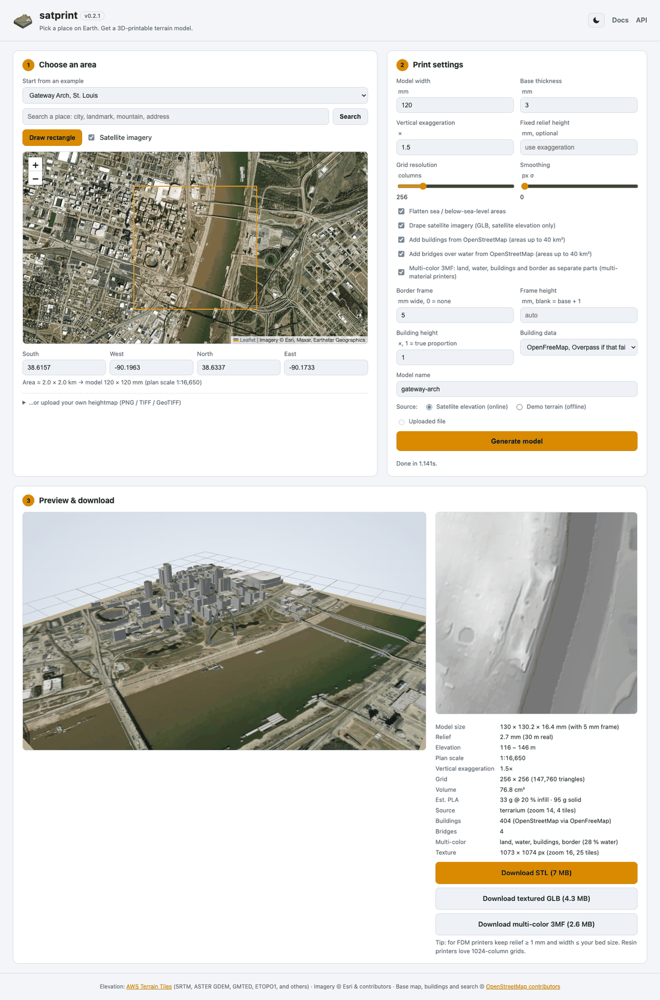
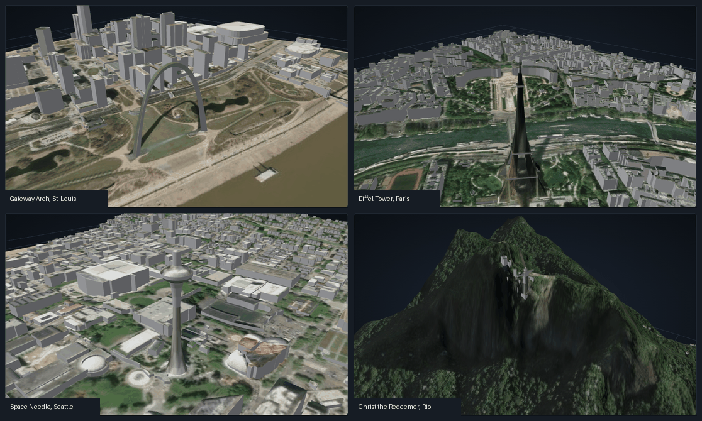
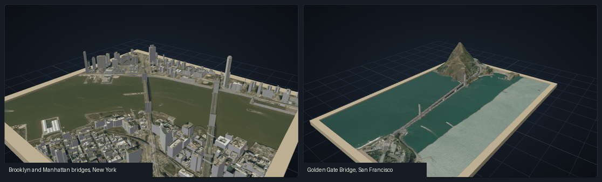
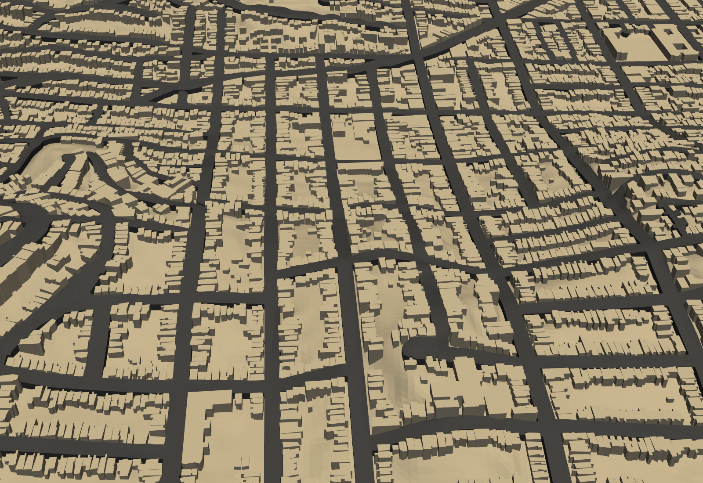

# satprint

**Satellite terrain to 3D-printable models.**

*Eric G. Suchanek, PhD -- Flux-Frontiers*

Pick a place on a map and satprint turns its real elevation data into a solid
relief model scaled to your printer: the terrain on top, four walls and a flat
base. You get three files from the same model:

- a watertight **STL** of the terrain and its buildings, for a one-color print;
- a **multi-color 3MF** that splits the model into land, water, buildings and a
  border frame, one filament each, for a multi-material printer;
- a **GLB** with satellite imagery draped over the terrain and the roofs, for
  viewing in Blender, macOS Quick Look or a web viewer.

The page follows your system's light or dark setting, and the button in the
header switches it:

Mount Fuji from real elevation tiles, 120 mm wide with a 5 mm frame, 1.5x
exaggeration:

Landmarks that building outlines cannot describe are built as meshes: the
Gateway Arch, the Eiffel Tower, the Space Needle and Christ the Redeemer.

Bridges over water get a deck on piers, here the Brooklyn and Manhattan bridges
and the Golden Gate Bridge:

Roads are raised strips that follow the ground, here around Twin Peaks in San
Francisco, printed in their own color from the 3MF:

## What it does

- **Real elevation, no API key.** Elevation comes from the public AWS Terrain
  Tiles set (SRTM, ASTER, GMTED and others). You can also upload a heightmap or
  use a procedural demo terrain that needs no network.
- **Print-aware output.** True plan scale, vertical exaggeration or a fixed
  relief height, base thickness, sea-level flattening, smoothing and grids up
  to 1024 columns. Each build reports the model size, scale, triangle count,
  volume and an estimated PLA weight.
- **Watertight by construction.** Every edge is shared by exactly two
  outward-wound triangles, so slicers load the STL without repair.
- **Buildings** from OpenStreetMap, as closed solids standing on the terrain.
  Towers keep their setbacks, and overlapping footprints are merged so no two
  solids pass through each other.
- **Bridges** over water from OpenStreetMap, as a raised deck on piers.
- **Roads** from OpenStreetMap, as raised strips that follow the terrain.
- **Five colors.** Land, water, buildings, roads and a border frame are
  separate parts of one 3MF object, already on filaments 1 to 5 in Bambu
  Studio.
- **Search and presets.** Search any place by name, or pick one of 70 presets:
  40 cities and landmarks and 30 mountains and landscapes.

## Where to go next

- [Install satprint](install.md) and [run the web app](usage.md).
- [Print in several colors](multicolor.md) on a multi-material printer.
- Script it with the [CLI](cli.md) or the [REST API](rest-api.md).
- Read where the data comes from, and the limits, in
  [Data sources and limits](data-sources.md).
